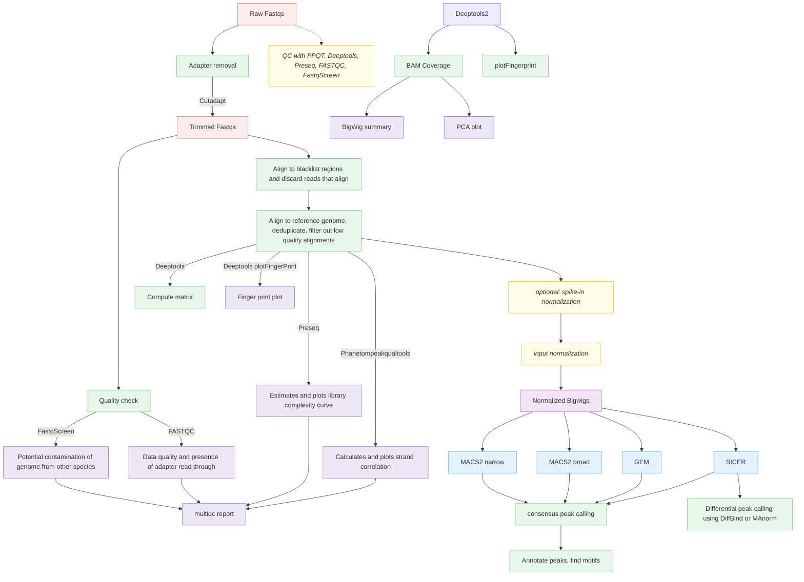
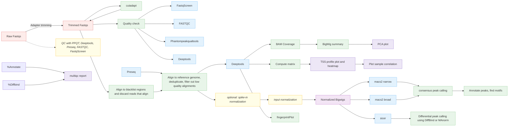

## vertical

```mermaid

flowchart TB

  %% Input
  %%Raw["Raw Fastqs"]:::input -->|Adapter trimming| Trimmed["Trimmed Fastqs"]:::input
  Raw["Raw Fastqs"]:::input --> Trimming["Adapter removal"]:::process
  Trimming --> |Cutadapt| Trimmed["Trimmed Fastqs"]:::input
  %%Adapter trimming --> Trimmed["Trimmed Fastqs"]:::input
  Raw -.-> QCnote["QC with PPQT, Deeptools, Preseq, FASTQC, FastqScreen"]:::note
  %%Trimmed --> Cutadapt["cutadapt"]:::process
  %%Cutadapt --> Trimmed

  %% Quality Control
  Trimmed --> QC["Quality check"]:::process
  %%QC --> FastqScreen["FastqScreen"]:::tool
  MultiQC["multiqc report"]:::output
  QC --> |FastqScreen| Contaminants["Potential contamination of genome from other species"]:::output
  Contaminants --> MultiQC
  %%QC --> FASTQC["FASTQC"]:::tool
  QC --> |FASTQC| QC_results["Data quality and presence of adapter read through"]:::output
  QC_results --> MultiQC
  %%QC --> Phantom["Phantompeakqualtools"]:::tool
  %%QC --> Deeptools["Deeptools"]:::tool

  %% Blacklist filtering
  Trimmed --> Blacklist["Align to blacklist regions and discard reads that align"]:::process

  %% Preseq and alignment
  %%Align["Align to reference genome, deduplicate, filter out low quality alignments"]:::process --> Preseq["Preseq"]:::tool
  Blacklist --> Align["Align to reference genome, deduplicate, filter out low quality alignments"]:::process
  %%Align --> Preseq["Preseq"]:::tool
  Align ----> |Preseq| Cc["Estimates and plots library complexity curve"]:::output
  Cc ---> MultiQC

  %% Phantompeakqualtools and alignment
  %%Align --> Ppqt["Phanetompeakqualtools"]:::tool
  Align ----> |Phanetompeakqualtools| Scc["Calculates and plots strand correlation"]:::output
  Scc --> MultiQC

  %% Spike-in normalization (optional)
  Align --> Spike["optional: spike-in normalization"]:::note
  Spike --> InputNorm["input normalization"]:::note
  InputNorm --> NormBigwigs["Normalized Bigwigs"]:::data

  %% Deeptools steps
  %%Align --> Deeptools["Deeptools"]:::tool
  Align --> |Deeptools| Matrix["Compute matrix"]:::process
  Deeptools2 --> BAMcov["BAM Coverage"]:::process
  Deeptools2 --> Fingerprint["plotFingerprint"]:::process
  Align --> |Deeptools plotFingerPrint| Fingerprintplot["Finger print plot"]:::output

  %%Matrix --> Heatmap["TSS profile plot and heatmap"]:::output
  BAMcov --> Bigwig["BigWig summary"]:::output
  BAMcov --> PCA["PCA plot"]:::output
  %%Matrix --> Correlation["Plot sample correlation"]:::output

  %% Peak calling
  NormBigwigs --> MACS2narrow["MACS2 narrow"]:::tool
  NormBigwigs --> MACS2broad["MACS2 broad"]:::tool
  NormBigwigs --> SICER["SICER"]:::tool
  NormBigwigs --> GEM["GEM"]:::tool
  
  MACS2narrow --> Consensus["consensus peak calling"]:::process
  MACS2broad --> Consensus
  GEM --> Consensus
  SICER --> Consensus
 
  SICER --> Diffbind["Differential peak calling using DiffBind or MAnorm"]:::process

  Consensus --> Annotate["Annotate peaks, find motifs"]:::process
  %%Annotate --> MultiQC["multiqc report"]:::output
  %%Diffbind --> MultiQC

  %% Styles
  classDef input fill:#fdecea,stroke:#e57373,stroke-width:1px;
  classDef process fill:#e8f5e9,stroke:#81c784,stroke-width:1px;
  classDef tool fill:#e3f2fd,stroke:#64b5f6,stroke-width:1px;
  classDef note fill:#fffde7,stroke:#fbc02d,stroke-width:1px,font-style:italic;
  classDef output fill:#ede7f6,stroke:#9575cd,stroke-width:1px;
  classDef data fill:#f3e5f5,stroke:#ba68c8,stroke-width:1px;
```

## horizontal

```mermaid
flowchart LR

%% Input
Raw["Raw Fastqs"]:::input -->|Adapter trimming| Trimmed["Trimmed Fastqs"]:::input
Raw -.-> QCnote["QC with PPQT, Deeptools, Preseq, FASTQC, FastqScreen"]:::note
Trimmed --> Cutadapt["cutadapt"]:::process
Cutadapt --> Trimmed


%% Quality Control
Trimmed --> QC["Quality check"]:::process
QC --> FastqScreen["FastqScreen"]:::tool
QC --> FASTQC["FASTQC"]:::tool
QC --> Phantom["Phantompeakqualtools"]:::tool
QC --> Deeptools["Deeptools"]:::tool


%% Blacklist filtering
Trimmed --> Blacklist["Align to blacklist regions and discard reads that align"]:::process


%% Preseq and alignment
Preseq["Preseq"]:::tool --> Align["Align to reference genome, deduplicate, filter out low quality alignments"]:::process
Blacklist --> Align


%% Spike-in normalization (optional)
Align --> Spike["optional: spike-in normalization"]:::note
Spike --> InputNorm["input normalization"]:::note
InputNorm --> NormBigwigs["Normalized Bigwigs"]:::data


%% Deeptools steps
Align --> Deeptools2["Deeptools"]:::tool
Deeptools2 --> Matrix["Compute matrix"]:::process
Deeptools2 --> BAMcov["BAM Coverage"]:::process
Deeptools2 --> Fingerprint["fingerprintPlot"]:::process


Matrix --> Heatmap["TSS profile plot and heatmap"]:::output
BAMcov --> Bigwig["BigWig summary"]:::process
Bigwig --> PCA["PCA plot"]:::output
Heatmap --> Correlation["Plot sample correlation"]:::output


%% Peak calling
NormBigwigs --> MACS2narrow["macs2 narrow"]:::tool
NormBigwigs --> MACS2broad["macs2 broad"]:::tool
NormBigwigs --> SICER["sicer"]:::tool

MACS2narrow --> Consensus["consensus peak calling"]:::process
MACS2broad --> Consensus
SICER --> Diffbind["Differential peak calling using DiffBind or MAnorm"]:::process


Consensus --> Annotate["Annotate peaks, find motifs"]:::process
%Annotate --> MultiQC["multiqc report"]:::output
%Diffbind --> MultiQC


%% Styles
classDef input fill:#fdecea,stroke:#e57373,stroke-width:1px;
classDef process fill:#e8f5e9,stroke:#81c784,stroke-width:1px;
classDef tool fill:#e3f2fd,stroke:#64b5f6,stroke-width:1px;
classDef note fill:#fffde7,stroke:#fbc02d,stroke-width:1px,font-style:italic;
classDef output fill:#ede7f6,stroke:#9575cd,stroke-width:1px;
classDef data fill:#f3e5f5,stroke:#ba68c8,stroke-width:1px;
```
