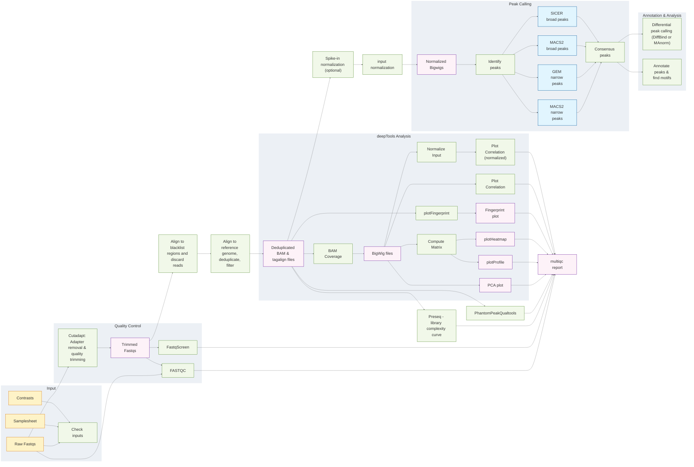

```mermaid
flowchart LR

%%{init: {
  "themeVariables": {
     "background": "transparent",
     "fontSize": "35px" },
  "flowchart": {
    "nodeSpacing": 80,
    "rankSpacing": 80,
    "padding": 35,
    "htmlLabels": true
}}}%%

  %% Input

  subgraph INPUT["Input"]
    Raw["Raw Fastqs"]:::input
    Samplesheet:::input
    Contrasts:::input
    Check["Check inputs"]:::process
    Raw --> Check
    Samplesheet --> Check
    Contrasts --> Check
  end


  %% Quality Control
  subgraph QC["Quality Control"]
    Raw --> Trimming["Cutadapt: Adapter removal & quality trimming"]:::process
    Trimming --> Trimmed["Trimmed Fastqs"]:::output
    Trimmed --> fqscreen["FastqScreen"]:::process
    Raw --> fqc["FASTQC"]:::process
    Trimmed --> fqc
  end
  fqc --> MultiQC["multiqc report"]:::output
  fqscreen --> MultiQC

  %% Alignment
  Trimmed --> Blacklist["Align to blacklist regions and discard reads"]:::process
  Blacklist --> Align["Align to reference genome, deduplicate, filter"]:::process
  Align --> BAMs["Deduplicated BAM & tagalign files"]:::output

  %% Library & Complexity Assessment
  BAMs --> preseq["Preseq - library complexity curve"]:::process
  BAMs --> ppqt["PhantomPeakQualtools"]:::process
  preseq ---> MultiQC
  ppqt --> MultiQC

  %% Normalization
      BAMs --> Spike["Spike-in normalization (optional)"]:::process
    Spike --> InputNorm["input normalization"]:::process
    InputNorm --> NormBigwigs["Normalized Bigwigs"]:::output


  %% deepTools Analysis
  subgraph DEEPTOOLS["deepTools Analysis"]
    BAMs --> BAMcov["BAM Coverage"]:::process
    BAMcov --> Bigwig["BigWig files"]:::output
    Bigwig --> Normalize["Normalize Input"]:::process
    Bigwig --> Correlation["Plot Correlation"]:::process
    Bigwig --> PCA["PCA plot"]:::output
    Normalize --> CorrelationNorm["Plot Correlation (normalized)"]:::process
    Bigwig --> Matrix["Compute Matrix"]:::process
    Matrix --> Profile["plotProfile"]:::output
    Matrix --> Heatmap["plotHeatmap"]:::output
    BAMs --> Fingerprint["plotFingerprint"]:::process
    Fingerprint --> FingerprintPlot["Fingerprint plot"]:::output
  end

  PCA --> MultiQC
  Profile --> MultiQC
  Heatmap --> MultiQC
  FingerprintPlot --> MultiQC
  Correlation --> MultiQC
  CorrelationNorm --> MultiQC

  %% Peak Calling
  subgraph PEAK["Peak Calling"]
    NormBigwigs --> Peakcalling["Identify peaks"]:::process
    Peakcalling --> MACS2narrow["MACS2 narrow peaks"]:::tool
    Peakcalling --> GEM["GEM narrow peaks"]:::tool
    Peakcalling --> MACS2broad["MACS2 broad peaks"]:::tool
    Peakcalling --> SICER["SICER broad peaks"]:::tool
    MACS2narrow --> Consensus["Consensus peaks"]:::process
    GEM --> Consensus
    MACS2broad --> Consensus
    SICER --> Consensus
  end

  %% Downstream Analysis
  subgraph DOWNSTREAM["Annotation & Analysis"]
    Consensus --> Diffbind["Differential peak calling (DiffBind or MAnorm)"]:::process
    Consensus --> Annotate["Annotate peaks & find motifs"]:::process
  end

  %% Styles - Modern sleek theme
  classDef input fill:#fef3c7,stroke:#d97706,stroke-width:2px;
  classDef process fill:#f1f8e9,stroke:#558b2f,stroke-width:2px;
  classDef tool fill:#e1f5fe,stroke:#01579b,stroke-width:2px;
  classDef output fill:#fdf2f8,stroke:#6a1b9a,stroke-width:2px;

  %% Subgraph styling
  style INPUT fill:#ecf0f5,stroke:none;
  style QC fill:#ecf0f5,stroke:none;
  style DEEPTOOLS fill:#ecf0f5,stroke:none;
  style PEAK fill:#ecf0f5,stroke:none;
  style DOWNSTREAM fill:#ecf0f5,stroke:none;
```
