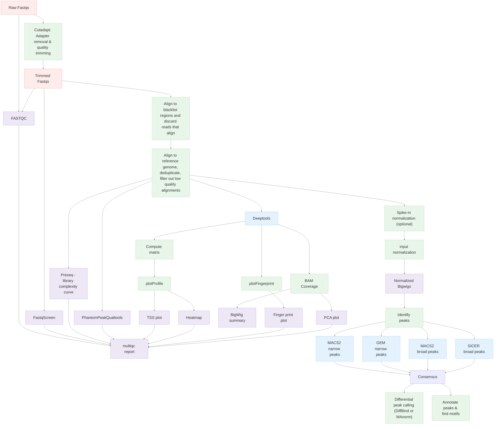
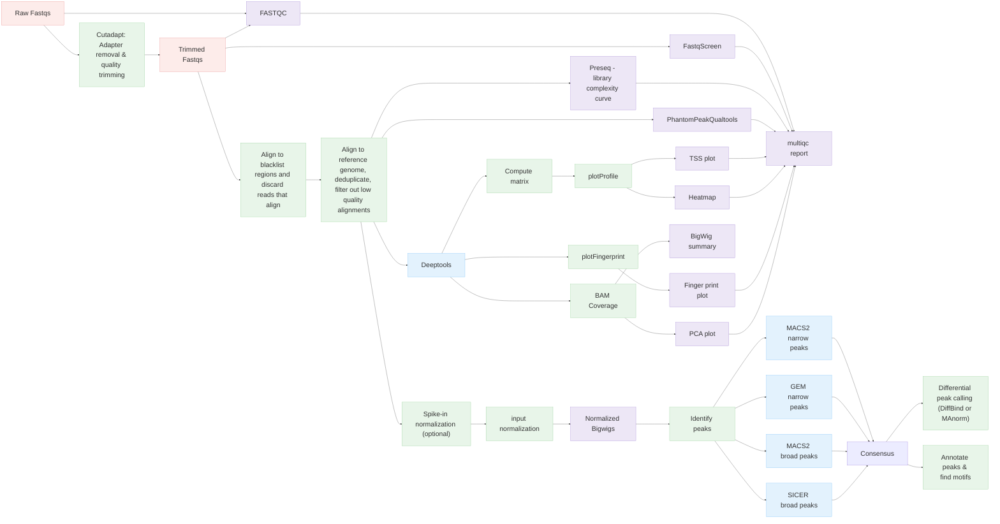

## vertical

```mermaid

%%{init: {
  "themeVariables": {
     "background": "transparent",
     "fontSize": "35px" },
  "flowchart": {
    "nodeSpacing": 80,
    "rankSpacing": 80,
    "padding": 35,
    "htmlLabels": true
}}}%%

flowchart TB

  %% Input
  Raw["Raw Fastqs"]:::input --> Trimming["Cutadapt: Adapter removal & quality trimming"]:::process
  Trimming --> Trimmed["Trimmed Fastqs"]:::input

  %% Quality Control
  MultiQC["multiqc report"]:::output
  Trimmed --> fqscreen["FastqScreen"]:::output
  Raw --> QC_results
  Trimmed --> QC_results["FASTQC"]:::output
  QC_results --> MultiQC
  fqscreen --> MultiQC

  %% Blacklist filtering
  Trimmed --> Blacklist["Align to blacklist regions and discard reads that align"]:::process

  %% Preseq and alignment
  Blacklist --> Align["Align to reference genome, deduplicate, filter out low quality alignments"]:::process
  Align --> Cc["Preseq - library complexity curve"]:::output
  Cc ---> MultiQC

  Align --> Scc["PhantomPeakQualtools"]:::output
  Scc --> MultiQC

  %% Spike-in normalization (optional)
  Align --> Spike["Spike-in normalization (optional)"]:::process
  Spike --> InputNorm["input normalization"]:::process
  InputNorm --> NormBigwigs["Normalized Bigwigs"]:::output

  %% Deeptools steps
  Align --> Deeptools["Deeptools"]:::tool
  Deeptools --> Matrix["Compute matrix"]:::process
  Matrix --> Profile["plotProfile"]:::process
  Profile --> TSSplot["TSS plot"]:::output
  Profile --> Heatmap["Heatmap"]:::output
  TSSplot --> MultiQC
  Heatmap --> MultiQC
  Deeptools --> fingerprint["plotFingerprint"]:::process
  fingerprint --> fingerprintplot["Finger print plot"]:::output
  fingerprintplot --> MultiQC
  Deeptools --> BAMcov["BAM Coverage"]:::process
  BAMcov --> PCA["PCA plot"]:::output & Bigwig["BigWig summary"]:::output
  PCA --> MultiQC

  %% Peak calling
  NormBigwigs --> Peakcalling["Identify peaks"]:::process
  Peakcalling --> MACS2narrow["MACS2 narrow peaks"]:::tool
  Peakcalling --> GEM["GEM narrow peaks"]:::tool
  Peakcalling --> MACS2broad["MACS2 broad peaks"]:::tool
  Peakcalling --> SICER["SICER broad peaks"]:::tool
  MACS2narrow --> Consensus
  GEM --> Consensus
  MACS2broad --> Consensus
  SICER --> Consensus
  Consensus --> Diffbind["Differential peak calling (DiffBind or MAnorm)"]:::process
  Consensus --> Annotate["Annotate peaks & find motifs"]:::process

  %% Styles
  classDef input fill:#fdecea,stroke:#e57373,stroke-width:1px;
  classDef process fill:#e8f5e9,stroke:#81c784,stroke-width:1px;
  classDef tool fill:#e3f2fd,stroke:#64b5f6,stroke-width:1px;
  classDef note fill:#fffde7,stroke:#fbc02d,stroke-width:1px,font-style:italic;
  classDef output fill:#ede7f6,stroke:#9575cd,stroke-width:1px;
  classDef data fill:#f3e5f5,stroke:#ba68c8,stroke-width:1px;
```

## horizontal

```mermaid
flowchart LR

%%{init: {
  "themeVariables": {
     "background": "transparent",
     "fontSize": "35px" },
  "flowchart": {
    "nodeSpacing": 80,
    "rankSpacing": 80,
    "padding": 35,
    "htmlLabels": true
}}}%%

  %% Input
  Raw["Raw Fastqs"]:::input --> Trimming["Cutadapt: Adapter removal & quality trimming"]:::process
  Trimming --> Trimmed["Trimmed Fastqs"]:::input

  %% Quality Control
  MultiQC["multiqc report"]:::output
  Trimmed --> fqscreen["FastqScreen"]:::output
  Raw --> QC_results
  Trimmed --> QC_results["FASTQC"]:::output
  QC_results --> MultiQC
  fqscreen --> MultiQC

  %% Blacklist filtering
  Trimmed --> Blacklist["Align to blacklist regions and discard reads that align"]:::process

  %% Preseq and alignment
  Blacklist --> Align["Align to reference genome, deduplicate, filter out low quality alignments"]:::process
  Align --> Cc["Preseq - library complexity curve"]:::output
  Cc ---> MultiQC

  Align --> Scc["PhantomPeakQualtools"]:::output
  Scc --> MultiQC

  %% Spike-in normalization (optional)
  Align --> Spike["Spike-in normalization (optional)"]:::process
  Spike --> InputNorm["input normalization"]:::process
  InputNorm --> NormBigwigs["Normalized Bigwigs"]:::output

  %% Deeptools steps
  Align --> Deeptools["Deeptools"]:::tool
  Deeptools --> Matrix["Compute matrix"]:::process
  Matrix --> Profile["plotProfile"]:::process
  Profile --> TSSplot["TSS plot"]:::output
  Profile --> Heatmap["Heatmap"]:::output
  TSSplot --> MultiQC
  Heatmap --> MultiQC
  Deeptools --> fingerprint["plotFingerprint"]:::process
  fingerprint --> fingerprintplot["Finger print plot"]:::output
  fingerprintplot --> MultiQC
  Deeptools --> BAMcov["BAM Coverage"]:::process
  BAMcov --> PCA["PCA plot"]:::output & Bigwig["BigWig summary"]:::output
  PCA --> MultiQC

  %% Peak calling
  NormBigwigs --> Peakcalling["Identify peaks"]:::process
  Peakcalling --> MACS2narrow["MACS2 narrow peaks"]:::tool
  Peakcalling --> GEM["GEM narrow peaks"]:::tool
  Peakcalling --> MACS2broad["MACS2 broad peaks"]:::tool
  Peakcalling --> SICER["SICER broad peaks"]:::tool
  MACS2narrow --> Consensus
  GEM --> Consensus
  MACS2broad --> Consensus
  SICER --> Consensus
  Consensus --> Diffbind["Differential peak calling (DiffBind or MAnorm)"]:::process
  Consensus --> Annotate["Annotate peaks & find motifs"]:::process

  %% Styles
  classDef input fill:#fdecea,stroke:#e57373,stroke-width:1px;
  classDef process fill:#e8f5e9,stroke:#81c784,stroke-width:1px;
  classDef tool fill:#e3f2fd,stroke:#64b5f6,stroke-width:1px;
  classDef note fill:#fffde7,stroke:#fbc02d,stroke-width:1px,font-style:italic;
  classDef output fill:#ede7f6,stroke:#9575cd,stroke-width:1px;
  classDef data fill:#f3e5f5,stroke:#ba68c8,stroke-width:1px;
```
