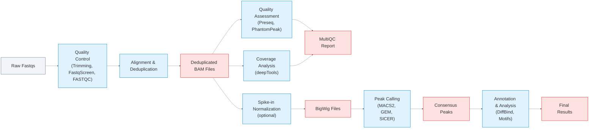

```mermaid
flowchart LR

%%{init: {
  "themeVariables": {
     "background": "transparent",
     "fontSize": "35px" },
  "flowchart": {
    "nodeSpacing": 100,
    "rankSpacing": 100,
    "padding": 40,
    "htmlLabels": true
}}}%%

  %% High-level stages
  Raw["Raw Fastqs"]:::input
  Raw --> QC["Quality Control<br/>(Trimming, FastqScreen, FASTQC)"]:::process
  QC --> Align["Alignment & Deduplication"]:::process
  Align --> BAMs["Deduplicated BAM Files"]:::output

  BAMs --> Assessment["Quality Assessment<br/>(Preseq, PhantomPeak)"]:::process
  BAMs --> Deeptools["Coverage Analysis<br/>(deepTools)"]:::process
  BAMs --> Norm["Spike-in Normalization<br/>(optional)"]:::process

  Assessment --> Reports["MultiQC Report"]:::output
  Deeptools --> Reports
  Norm --> Bigwigs["BigWig Files"]:::output
  Bigwigs --> Peaks["Peak Calling<br/>(MACS2, GEM, SICER)"]:::process
  Peaks --> Consensus["Consensus Peaks"]:::output
  Consensus --> Downstream["Annotation & Analysis<br/>(DiffBind, Motifs)"]:::process
  Downstream --> Final["Final Results"]:::output

  %% Styles - Modern minimal sleek theme
  classDef input fill:#f1f5f9,stroke:#64748b,stroke-width:2px;
  classDef process fill:#e0f2fe,stroke:#0284c7,stroke-width:2px;
  classDef output fill:#fee2e2,stroke:#dc2626,stroke-width:2px;
```
